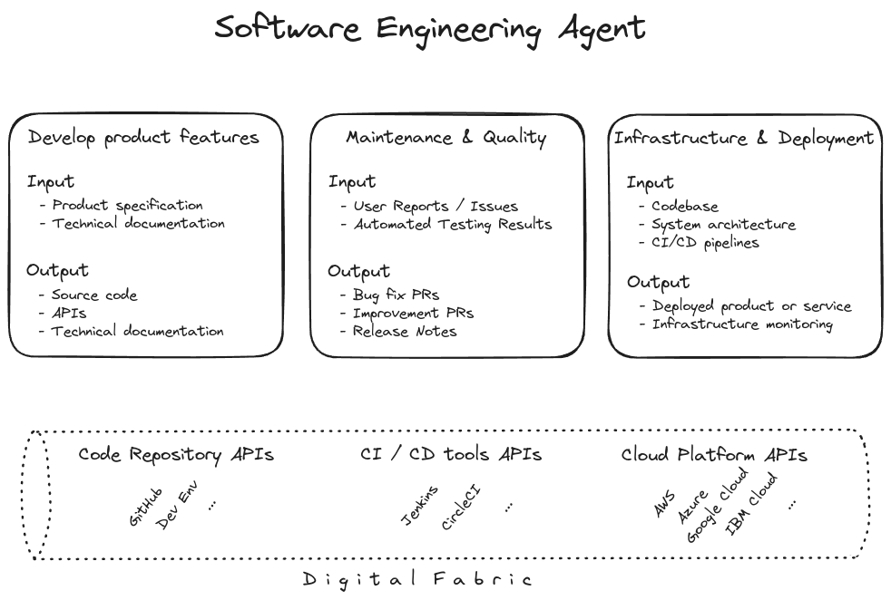

# Software Engineering Agent as a set of langGraph(s)

First step towards creating a software engineering agent is to understand its role and responsibilities. Here's a rough sketch:



Broadly, we expect a software engineer to develop new features, fix bugs, and deploy. For those tasks the engineer is expected to receive inputs from enterprise internal or external (web) resources. We call it the *digital fabric*.

In this work we implement an agent that may perform these tasks using Large Language Models (LLMs).
Emulating the behavior of a human agent, we'll implement workflows to:
- understand the code base at granular level
- develop a higher-order understanding at the level of packages
- for an enhancement request, or bug, or user query: use the understanding to localize it to packages and files, and then suggest code enhancements to address those.

## How to use this repository

### Clone, install, and run

1.  Create and activate a virtual environment
    ```bash
    git clone https://github.com/praneetdhoolia/langgraph-se-agent.git
    cd langgraph-se-agent
    python3 -m venv .venv
    source .venv/bin/activate
    ```

2.  Install Langgraph CLI
    ```bash
    pip install -U "langgraph-cli[inmem]"
    ```
    Note: "inmem" extra(s) are needed to run LangGraph API server in development mode (without requiring Docker installation)

3.  Install the dependencies
    ```bash
    pip install -e .
    ```

4.  Configure environment variables
    ```bash
    cp example.env .env
    ```
    and edit `.env`

5. Run
    ```bash
    langgraph dev
    ```

### Onboard

Like a new member joining the team, the agent is expected to:
- formulate a fine-grained semantic understanding of individual files in the repository
- formulate a high-level semantic understanding of logical grouping in the repository

Configure:
- respository
- src path
- access token
- prompts and models

and **Onboard!**